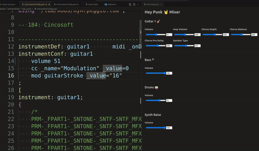

# UiUi

Silly little UI panel which renders source code.

## What for
I just use it to create mixer panels for my werckmeister projects.

So with werckmeister I create music source code and with UiUi I mix the weckmeister instruments. 

